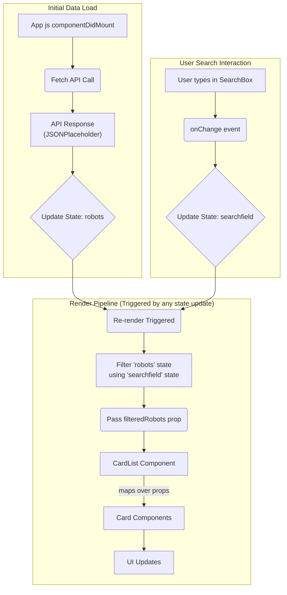

# Application Architecture

## 1. Overview

RoboFriends is a client-side Single Page Application (SPA) built using React and bootstrapped with Create React App (CRA). It follows a component-based architecture where the UI is broken down into reusable pieces. The application fetches data from an external API, manages its state locally within the main component, and renders a dynamic list of "robot" cards that can be filtered via a search input.

## 2. Folder Structure

The project follows a standard CRA structure with some conventions for organizing components:

```
robofriends/
├── README.md           # This file
├── package.json        # Project dependencies and scripts
├── public/             # Static assets and index.html template
│   ├── index.html      # Main HTML entry point
│   ├── manifest.json   # PWA manifest
│   └── robots.txt      # Instructions for web crawlers
└── src/                # Application source code
    ├── index.css       # Global styles
    ├── index.js        # Application entry point (renders App)
    ├── reportWebVitals.js # Performance monitoring setup
    ├── robots.js       # Static robot data (currently unused)
    ├── components/     # Reusable, stateless UI components
    │   ├── Card.js       # Displays a single robot card
    │   ├── CardList.js   # Displays a list of Card components
    │   ├── Scroll.js     # Wraps content in a scrollable container
    │   └── SearchBox.js  # Renders the search input field
    └── containers/       # Stateful components / Page-level components
        ├── App.css       # Styles specific to the App container (incl. font)
        ├── App.js        # Main application component (state, logic)
        └── SEGA.woff     # Custom font file
```

- **`public/`**: Contains the base HTML file (`index.html`) where the React app is mounted, and other static assets like icons or manifests.
- **`src/`**: Contains all the JavaScript and CSS source code for the React application.
- **`src/components/`**: Contains "presentational" or "dumb" components. These components generally receive data and callbacks via props and are primarily concerned with how things look. They don't manage their own state related to application data.
- **`src/containers/`**: Contains "container" or "smart" components. These components are often class-based (though can be functional with Hooks) and are responsible for managing state, fetching data, containing business logic, and rendering corresponding presentational components. `App.js` serves as the main container here.

## 3. Major Components

- **`App.js` (Container):**
  - The root component of the application.
  - Manages the main application state: `robots` (array of robot data) and `searchfield` (current search term).
  - Fetches robot data from the JSONPlaceholder API using `fetch` in `componentDidMount`.
  - Handles user input from the `SearchBox` via the `onSearchChange` method to update the `searchfield` state.
  - Filters the `robots` array based on the `searchfield`.
  - Renders the main layout including the title, `SearchBox`, and `CardList` (wrapped in `Scroll`).
  - Passes down state and callbacks as props to child components (`filterRobots` to `CardList`, `onSearchChange` to `SearchBox`).
- **`SearchBox.js` (Component):**
  - A simple functional component rendering an `<input type="search">`.
  - Receives the `searchChange` callback function as a prop and calls it whenever the input value changes.
  - Stateless regarding application data.
- **`Scroll.js` (Component):**
  - A wrapper component that provides vertical scrolling for its children.
  - Uses inline styles to set `overflow-y: scroll` and a fixed height.
  - Useful for containing lists that might grow large, like the `CardList`.
- **`CardList.js` (Component):**
  - A functional component that receives an array of `robots` as a prop.
  - Maps over the `robots` array and renders a `Card` component for each robot.
  - Responsible for iterating and displaying múltiplice cards.
- **`Card.js` (Component):**
  - A functional component responsible for rendering a single robot's information.
  - Receives `id`, `name`, `username`, and `email` as props.
  - Displays the robot's image (fetched from `robohash.org` using the `id`), name, username, and email.
  - Uses Tachyons classes for styling (e.g., `bg-light-green`, `grow`, `shadow-5`).

## 4. Data Flow

The application follows a predominantly unidirectional data flow, typical in React:

1.  **Initialization:** `App.js` mounts. Its initial state has an empty `robots` array and an empty `searchfield`.
2.  **Data Fetching:** `componentDidMount` in `App.js` triggers a `fetch` call to `https://jsonplaceholder.typicode.com/users`.
3.  **State Update (Data):** Upon successful fetch, the response is converted to JSON, and `App.js` updates its `robots` state using `setState`. This triggers a re-render.
4.  **Rendering:** `App.js`'s `render` method executes. If `robots` isn't empty, it filters the `robots` based on the current (empty) `searchfield`. The full (or filtered) list is passed as the `robots` prop to `CardList`.
5.  **List Rendering:** `CardList` receives the `robots` prop, maps over it, and renders a `Card` for each robot, passing individual robot data (`id`, `name`, etc.) as props.
6.  **Card Rendering:** Each `Card` component renders the robot's details and image.
7.  **User Interaction (Search):** The user types into the `SearchBox`.
8.  **Event Handling:** The `onChange` event on the `SearchBox` input triggers the `onSearchChange` method passed down from `App.js`.
9.  **State Update (Search):** `onSearchChange` in `App.js` updates the `searchfield` state using `setState`. This triggers another re-render.
10. **Re-rendering with Filter:** `App.js`'s `render` method executes again. This time, `filterRobots` uses the updated `searchfield` to create a new, filtered array of robots. This filtered array is passed down to `CardList`, and the UI updates accordingly.



## 5. Design Decisions

- **Create React App:** Chosen for its quick setup and pre-configured build process, abstracting away complex Webpack/Babel configurations.
- **React Component Model:** Leverages React's component-based structure for modularity and reusability.
- **Container/Component Pattern:** Separates concerns between data handling/logic (`App.js`) and presentation (`Card`, `CardList`, `SearchBox`).
- **Class Component for State:** `App.js` uses a class component to manage state and lifecycle methods. (Could be refactored using Hooks).
- **External API:** Uses JSONPlaceholder for readily available sample data, demonstrating asynchronous operations.
- **Tachyons:** Employs a utility-first CSS approach for rapid styling without writing much custom CSS.
- **`fetch` API:** Uses the browser's native API for making HTTP requests.
- **`Scroll` Component:** A simple solution for handling potentially long lists within a fixed-height container without needing a full virtualization library for this scale.
- **RoboHash:** Provides a fun and easy way to generate unique images for each card without needing actual image assets.
